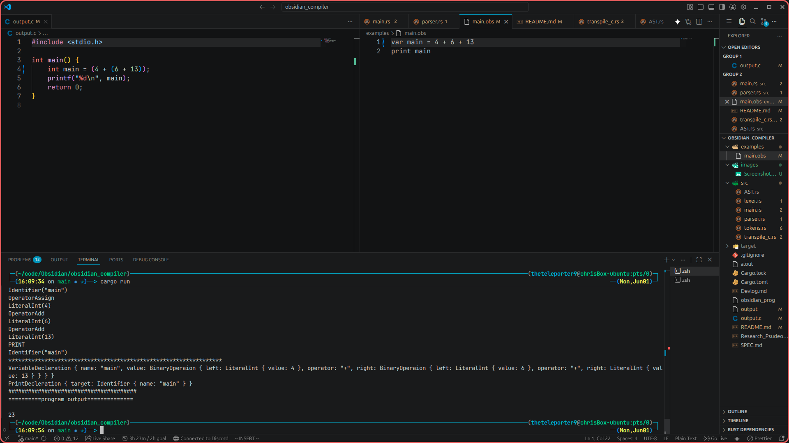

### DEV NOTE
All logic comes form non AI developer.
Only some implementation has been used with AI to help to get stuff working.
Read me has been made to look better by AI, and check for spelling.

# What is Obsidian?

Obsidian (soon to be **Flint**) is a high-level programming language designed to simplify low-level development. It is a source-to-source transpiler written in **Rust** that generates standard **C** code, which is then compiled with **GCC**.

The project is primarily a learning experience and is still in its early stages. Although many core language features are already implemented, the language is still evolving and many advanced features are planned.

---

# Installation

## Requirements

Before compiling Obsidian, make sure the following software is installed:

* **Rust** (latest stable version)
* **Cargo** (installed automatically with Rust)
* **GCC** (C compiler)
* **Git** (optional, for cloning the repository)

---

## 1. Install Rust

### Linux / macOS

Run:

```bash
curl --proto '=https' --tlsv1.2 -sSf https://sh.rustup.rs | sh
```

After installation, restart your terminal and verify:

```bash
rustc --version
cargo --version
```

### Windows

Download and run the installer from:

https://rustup.rs

Verify:

```bash
rustc --version
cargo --version
```

---

## 2. Install GCC

### Ubuntu / Debian

```bash
sudo apt update
sudo apt install build-essential
```

Verify:

```bash
gcc --version
```

---

### Arch Linux

```bash
sudo pacman -S gcc
```

---

### Fedora

```bash
sudo dnf install gcc
```

---

### Windows

Install one of the following:

* MSYS2 (recommended)
* MinGW-w64

Ensure `gcc` has been added to your system `PATH`.

Verify:

```bash
gcc --version
```

---

## 3. Clone the Repository

```bash
git clone https://github.com/<your-username>/Obsidian.git

cd Obsidian
```

Or download the repository as a ZIP and extract it.

---

## 4. Build the Compiler

Compile Obsidian:

```bash
cargo build --release
```

The executable will be located at:

### Linux / macOS

```text
target/release/obsidian
```

### Windows

```text
target\release\obsidian.exe
```

---

## 5. Create a Source File

Create a file ending in `.obs`.

Example:

```text
hello.obs
```

Example contents:

```obsidian
print "Hello, World!"
```

---

## 6. Run the Compiler

Using Cargo:

```bash
cargo run -- /absolute/path/to/program.obs
```

Example:

```bash
cargo run -- ~/projects/hello.obs
```

Using the compiled executable:

### Linux

```bash
./target/release/obsidian /absolute/path/to/program.obs
```

### Windows

```powershell
target\release\obsidian.exe C:\Users\Chris\Documents\hello.obs
```

---

## 7. What Happens Internally?

When Obsidian runs, it performs the following steps:

1. Reads the `.obs` source file.
2. Tokenizes the source code.
3. Parses the tokens into an Abstract Syntax Tree (AST).
4. Performs semantic type checking.
5. Transpiles the AST into C code.
6. Saves the generated code as `output.c`.
7. Invokes GCC to compile the C source.
8. Executes the resulting program.

The generated C source can be found in:

```text
output.c
```

---

## Troubleshooting

### "gcc was not found in PATH"

GCC is either not installed or is not available from your terminal.

Verify:

```bash
gcc --version
```

---

### "cargo: command not found"

Rust was not installed correctly, or Cargo is not in your `PATH`.

Verify:

```bash
cargo --version
```

---

### "please provide an absolute path"

Obsidian currently requires an absolute path to the source file.

Example:

```bash
cargo run -- /home/user/projects/program.obs
```

instead of

```bash
cargo run -- program.obs
```

---

### C Compilation Failed

If GCC reports an error, the generated source is preserved as:

```text
output.c
```

Open this file to inspect the generated C code and locate the issue.


---

# Current Language Features

## Variable Declaration

```obsidian
var <type> <name> = <expression>
```

Example:

```obsidian
var int number = 42
var float pi = 3.14159
var bool running = true
var string message = "Hello!"
```

---

## Supported Types

* **int** — Whole numbers
* **float** — Decimal numbers
* **bool** — `true` or `false`
* **string** — Text enclosed in quotation marks

---

## Arithmetic

Supported operators:

```text
+  -  *  /
```

Example:

```obsidian
var int result = 5 + 10 * 2
```

Arithmetic is currently supported for numeric types (`int` and `float`).

---

## Expressions

Expressions may be written without explicitly assigning the result.

```obsidian
x + 5
```

Currently, the **first variable encountered** in the expression receives the result automatically.

The above is equivalent to:

```obsidian
x = x + 5
```

For more complex expressions, ensure the variable you wish to update appears first.

Example:

```obsidian
x + 2 - (y * 5)
```

becomes

```obsidian
x = x + 2 - (y * 5)
```

> **Note:** This behavior is temporary and will be redesigned in a future version.

---

## Assignment

Variables can also be reassigned normally.

```obsidian
x = 25

message = "Goodbye"

running = false
```

---

## Comparisons

Supported comparison operators:

```text
==
!=
<
<=
>
>=
```

Example:

```obsidian
var bool bigger = x > y
```

---

## Logical Operators

```text
and
or
!
```

Example:

```obsidian
var bool valid = x > 10 and !(y == 5)
```

Logical expressions are fully type checked.

---

## Strings

String literals are supported.

```obsidian
var string name = "Flint"

print name
```

Current limitations:

* No concatenation (`+`) yet
* No interpolation (`"Hello $name"`) yet
* No indexing
* No iteration

These features are planned.

---

## Printing

Print any expression using:

```obsidian
print <expression>
```

Supported output:

* int
* float
* bool (`true` / `false`)
* string

Examples:

```obsidian
print 42

print 3.14

print true

print "Hello!"
```

---

## Type Checking

The compiler performs semantic analysis before generating C.

It currently checks:

* Variable declarations
* Assignments
* Arithmetic expressions
* Logical expressions
* Comparison expressions
* Unary operators
* Undefined variables
* Type mismatches

Compilation stops if a type error is detected.

---

# Example Program

```obsidian
# Hello World #

var int x = 10
var int y = 20

var float scale = 3.6

var string greeting = "Hello"

var bool valid = x < y and scale != 10 and greeting == "Hello"

print "Before"
print x

# Expression statements automatically assign back
# to the first variable (temporary behaviour)

x + 5 * 2

print "After"
print x

print greeting

print valid
```

---

# Current Status

Implemented:

* ✅ Lexer
* ✅ Parser
* ✅ AST generation
* ✅ Semantic type checker
* ✅ C transpiler
* ✅ Automatic GCC compilation
* ✅ Variables
* ✅ Assignments
* ✅ Arithmetic expressions
* ✅ Unary operators
* ✅ Comparison operators
* ✅ Logical operators
* ✅ Strings
* ✅ Printing
* ✅ Expression statements

Planned:

* ⬜ String concatenation
* ⬜ String interpolation
* ⬜ Functions
* ⬜ If / Else
* ⬜ While loops
* ⬜ Arrays
* ⬜ Structs
* ⬜ Modules
* ⬜ Memory management
* ⬜ Standard library
* ⬜ Optimizer

Please note this behavior will change in future versions; this is an alpha build.


